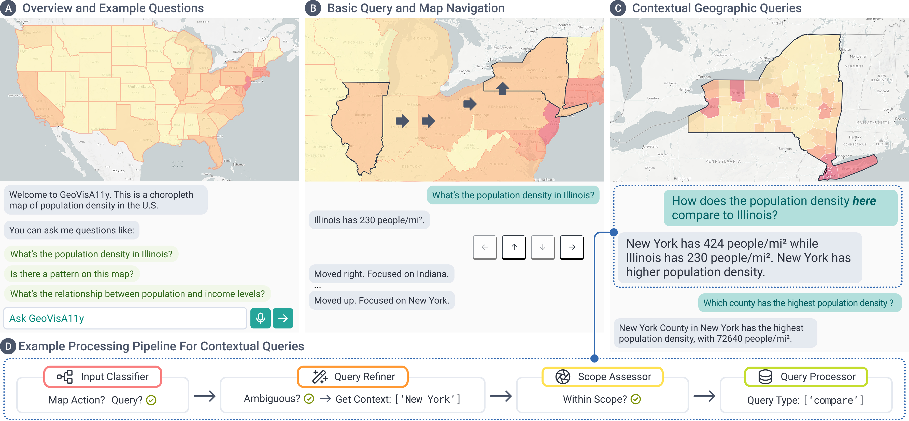

# GeoVisA11y

GeoVisA11y is an open-source system for interactive and accessible map visualization.
<!-- <br>
Check out our [paper preprint](PAPER_URL), [live demo](DEMO_URL), and [video](VIDEO_URL) for more information.
<br> -->
<br>



This repository contains the code for the GeoVisA11y prototype, presented in our CHI'26 paper *GeoVisA11y: AI-based Geovisualization QA System for Screen-Reader Users* by Chu Li, Rock Pang, Arnavi Chheda-Kothary, Ather Sharif, Henok Assalif, Jeffrey Heer and Jon E. Froehlich.

### Cite GeoVisA11y
```
@inproceedings{li2026geovisa11y,
  author={Li, Chu and Pang, Rock and Chheda-Kothary, Arnavi and Sharif, Ather and Assalif, Henok and Heer, Jeffrey and Froehlich, Jon E.},
  booktitle={2026 CHI Conference on Human Factors in Computing Systems (CHI)}, 
  title={GeoVisA11y: AI-based Geovisualization QA System for Screen-Reader Users}, 
  year={2026},
  pages={1-17},
  keywords={Geovisualization;Accessibility;Screen-reader;AI;QA;Visualization},
  doi={https://doi.org/10.1145/3772318.3790334}}
```

## Architecture

- **Frontend** (`src/`): React app with Mapbox GL for choropleth and dot-density map visualizations, plus a speech-enabled chatbot
- **Backend** (`backend/`): Flask API with DuckDB for spatial queries, OpenAI for natural language QA, and MongoDB for analytics logging
<!-- - **Deployment** (`deploy/`): Dockerfile, Cloud Build, and nginx configs for Google Cloud Run -->

## Setup

1. Copy `.env.example` to `.env` and fill in your API keys.
2. Place `spatial-db.db` in `backend/database/` (to request this file, please email chuchuli@cs.washington.edu)
3. Install dependencies:
   - **Backend:** `cd backend && pip install -r requirements.txt`
   - **Frontend:** `npm install`

<!-- ### Environment Variables

| Variable | Required | Description |
|----------|----------|-------------|
| `REACT_APP_MAPBOX_TOKEN` | Yes | Mapbox GL access token for map rendering |
| `OPENAI_API_KEY` | Yes | OpenAI API key for QA and speech transcription |
| `MONGO_URI` | Optional | MongoDB Atlas connection string for analytics logging |
| `REACT_APP_API_URL` | Optional | Backend API URL (defaults to `http://localhost:5000`) |
| `CORS_ORIGINS` | Optional | Comma-separated allowed origins (defaults to `http://localhost:3000`) | -->

## Running the Application

**Backend:**
```bash
cd backend
flask run
```

**Frontend:**
```bash
npm start
```

The app will open at [http://localhost:3000](http://localhost:3000)

## Debug Logging

Backend logging is controlled by the `level` parameter in each file's `logging.basicConfig()` call:
- `backend/routes/log_routes.py` — set to `WARNING` by default
- `backend/routes/api.py` — set to `INFO` by default

To see verbose debug output, change the level to `logging.DEBUG`:
```python
logging.basicConfig(level=logging.DEBUG)
```

## License

This project is licensed under the MIT License. See [LICENSE](LICENSE) for details.
